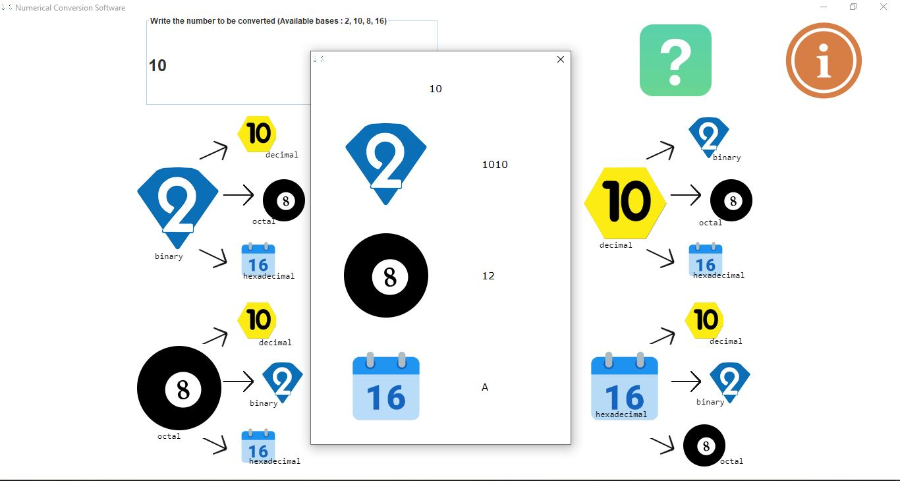

# Numerical Systems Conversion Software

This desktop app allows you to make numerical base conversions.

## **Conversions between all these bases:**

- Binary ✌
- Decimal 🕙
- Hexadecimal 1️⃣6️⃣
- Octal 🎱

## UI

---

